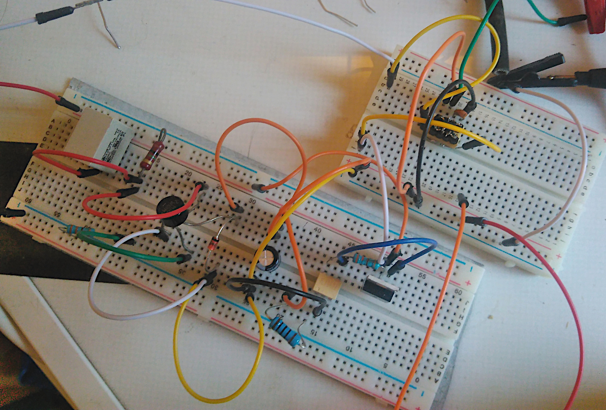
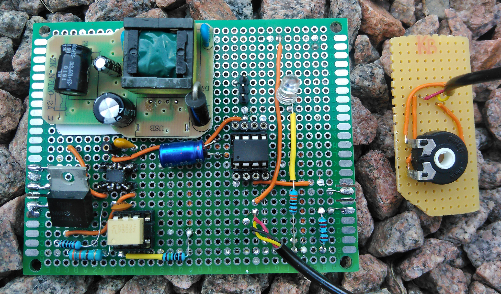
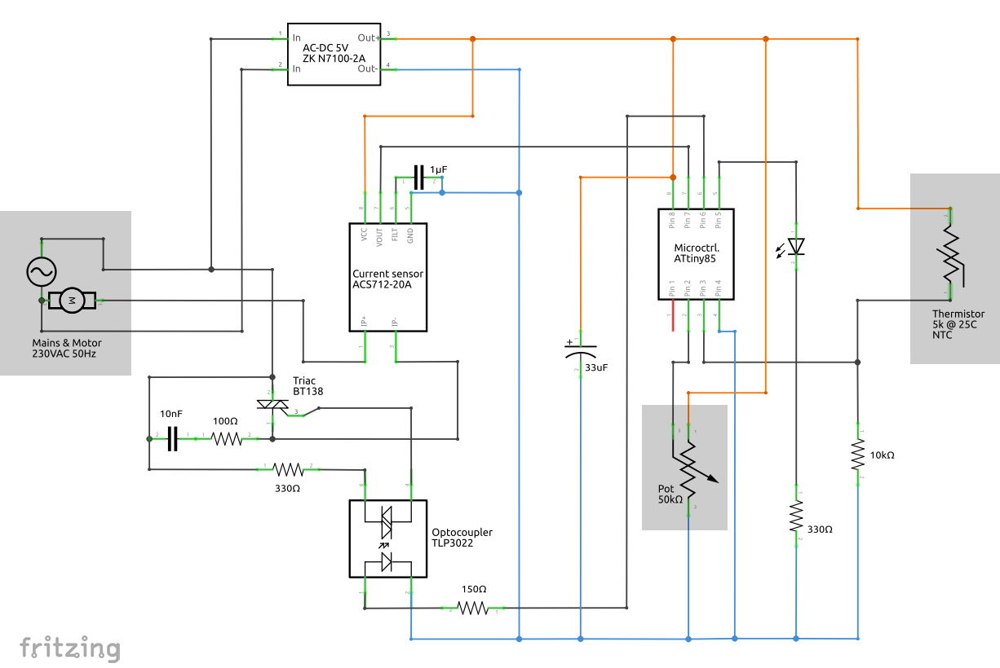
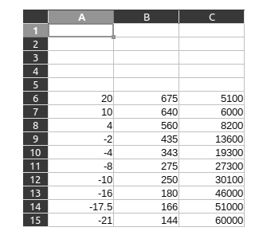
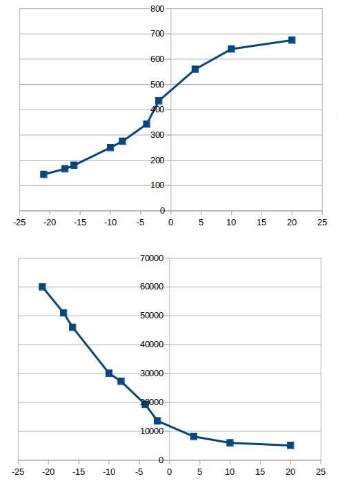

# Freezer Fridge

- License: MIT License
- Author: Matteljay
- Language: Arduino C++
- IDE: Arduino.cc
- Homepage: https://libersystems.com

## Table of contents

- [About](#about)
- [Prototyping](#prototyping)
- [Physical PCB](#physical-pcb)
- [Schematic](#schematic)
- [Components](#components)
- [Safety Features](#safety-features)
  - [Hardware](#hardware)
  - [Software](#software)
- [Temperature Calibration](#temperature-calibration)
- [Formulas](#formulas)
  - [Straight Line](#straight-line)
  - [Exponential Moving Average](#exponential-moving-average)
- [Contact & Donate](CONTACT.md)

## About

Replacing the PCB of a malfunctioning [Miele](https://miele.com) freezer and
adding a temperature adjustment from 10°C to -22°C so it can work as a fridge
as well. How hard can it be? Well to do it somewhat safely, there are some
challenges. You can find my attempt here with detailed explanation of the
electronics components, formulas and the microcontroller [source
code](freezer-fridge.ino) packed with safety features. What you cannot find
here is any kind of guarantee that this project won't end up burning down your
house. This information is meant for educational purposes only. Use any of this
information at your own risk. [Donate](CONTACT.md) a coffee if you find any
useful information here.

## Prototyping

Both the prototype and the first version used a capacitive dropper circuit to
convert 230V AC to 5V DC. A 5V USB power plug was later disassembled for the
low profile isolated PCB inside to power the integrated circuits on the main
board. More prototype pictures are in the [images](images/) folder.

## Physical PCB

Notice the horizontal cuts on the left and right sides of the board. This was
done with a fine metal saw so that external freezer hardware plugs can be
inserted: power, pump and temperature sensor. More screenshots and versions are
present in the [images](images/) folder.

The microcontroller is surrounded by female breakout pins which can be
connected wire for wire to an USBasp programmer. The three vertical male header
pins are connected to VCC, PIN 5 (LED) and GND for TTY console debug output.
That way, a PL2303 UART serial USB device can read all the messages from the
running Arduino.

## Schematic

The component placement and wiring on this schematic can roughly be translated
1:1 to the real physical layout. Concerning the shaded areas: the motor
(freezer pump) and thermistor are part of the freezer's unmodified hardware.
The potentiometer labeled *Pot* is a variable resistor used as the temperature
adjustment knob.

## Components

- **N7100-2A** disassembled European USB power plug 230V AC to 5V DC with a 2A
maximum.
- **ACS712-20A** Hall effect current sensor that can measure up to 20A maximum.
- **BT138-800** Sensitive logic level triac
- **TLP3022** Optocoupler of type photo-triac
- **ATtiny85** Low-power AVR RISC-based microcontroller
- **Thermistor** NTC type temperature resistor 5kΩ at 25°C
- **Motor** Freezer pump drawing around 4A at 230V AC when enabled by the triac

## Safety features

### Hardware

- An electrolytic capacitor across the ATtiny85's supply (pins 8 and 4) has
  noticeable error reducing effects on the operation. Especially time is kept
  much more accurately. This can be seen from TTY console character errors and
  even blinking LED timing.
- The combination of a 100Ω resistor with a 10nF capacitor (RC snubber) in
  parallel across the triac output should avoid it staying in a conductive
  state in case of sudden microcontroller shutdown.
- Switched from a capacitive dropper circuit to an isolated 5V power circuit.
- A clear coating was applied to the PCB's back to fixate the contacts, helping
  to prevent short circuits.
- A check was done to make sure the freezer is fused.

### Software

- *monitorAmps()* Use the ACS712 current sensor to determine if the pump is
  drawing normal and stable current. If not, do a detailed measurement cycle
  and watch for abnormal spikes.
- *pumpingTooLong()* Pumping for hours non-stop is not normal. If that
  happens, disable the pump completely and blink the LED forever with a one
  second interval.
- *badTempImpact()* After pumping non-stop for one hour, temperature **must**
  drop by at least 2°C. Otherwise the freezer's door is probably
  open. The pump is disabled completely and the LED blinks forever three times
  per second. Reconnect the power cable to restart the system.
- *fixTimeOverflows()* Arduino keeps time in *unsigned long* variable which
  can overflow (snap back to zero) after counting milliseconds for
  approximately 50 days. That means all values in the past must be manually
  reset as well.
- *checkTempSensor()* It temperature drops below -30°C, pause pump operation
  for a long time and notify with a non blinking LED.

## Temperature calibration

The temperature sensor is an NTC thermistor. This is a resistor component with
a *negative temperature coefficient* which means that the resistance decreases
with increasing temperature. Here are the measured values as the freezer pump
was started up from room temperature. Column A has the displayed value in
degrees Celsius from a simple plastic thermometer inside the middle freezer
drawer. Column B the pin value from the ATtiny. Column C is the resistance in
Ohms of the thermistor, manually measured with a multimeter.

The coldest areas inside the freezer are not located at the location of the
temperature sensor. It takes a couple of minutes for the temperature to become
uniform inside the freezer and be correctly sensed. The data above were
measurements taken as the pump was running so without this important
dissipation delay. However the shape of the graph is relevant in order to
decide how to relate measurements to real temperatures. Only the first graph is
relevant since only pin values will be measured by the microcontroller. An
approximation with a straight line will be used below. Judge for yourself if
this is accurate enough or you want to code a different math curve. Or perhaps
go for a multi line approach.

## Formulas

### Straight line

Pin values must be related to real temperatures somehow. As discussed above, a
simple straight line relation is chosen here. How to determine other points on
that line from having only two chosen points? This formula was used:

Refactoring in a more useful format where **m** is the slope and **q** the
intercept on the y-axis:

The comments in function [*calcVARs()*](freezer-fridge.ino) show the two
measured points that were really used to construct the final formula with
numerical values. To calculate the coefficients more easily, a
[LibreOffice](https://www.libreoffice.org/) Calc sheet is included
[here](line-2points.ods).

### Exponential moving average

The signals for temperature and the adjustment knob have some fluctuating noise
on their measurements. To account for that, initially the plan was to average
out those values with an SMA (simple moving average). However, using the EMA is
a better choice as it takes up less memory on the ATtiny since no arrays are
needed:

Here, **n** is the new EMA value, **m** is the measurement, **p** the previous
EMA and **k** the constant weighting of previous values, usually between 0 - 1.
The first term of that sum can become a floating point number, this format
was chosen to prevent that and work better with integer data types only:

Have a look at function [*calcVARs()*](freezer-fridge.ino) to see how much this
formula simplifies.

## Contact & Donate

More info here: [Contact](CONTACT.md)

